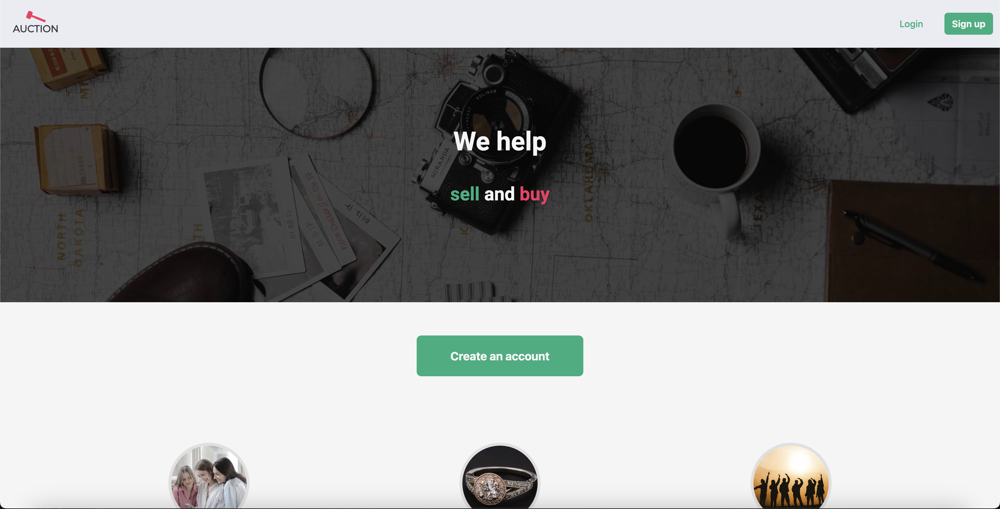

# Semester Project 2, Auction



## Deployment

 https://auction-semester-project-2.netlify.app/

## Description

An auction site is looking to launch a website where users can add items to be bid on and bid on items other users have put up for auction.
When a new user joins the website, they are given 1000 credits to use on the site. They can get credits by selling items and use credit by buying items. Non-registered users can search through the listings, but only registered users can make bids on listings.

The client has specified the following requirements in the form of User Stories:

- A user with a stud.noroff.no email may register
- A registered user may login
- A registered user may logout
- A registered user may update their avatar
- A registered user may view their total credit
- A registered user may create a Listing with a title, deadline date, media gallery and description
- A registered user may add a Bid to another user’s Listing
- A registered user may view Bids made on a Listing
- An unregistered user may search through Listings

## Built With

- [HTML](https://developer.mozilla.org/en-US/docs/Web/HTML)
- [Bootstrap](https://getbootstrap.com/)
- [JavaScript](https://developer.mozilla.org/en-US/docs/Web/JavaScript)
- [SASS](https://sass-lang.com/)

<div>
  &nbsp;
  &nbsp;
  &nbsp;
  &nbsp;
</div>

## API

API Documentation: https://docs.noroff.dev/docs/v2/auction-house/listings

API Swagger: https://v2.api.noroff.dev/docs/static/index.html

## Getting Started

### Installing

1. Clone the repo:

```
https://github.com/karolina-szymanska/auction-semester-project-2
```

2. Install the dependencies:

```
npm install
```

### Running

To run the app, run the following commands:

```
npm run start
```

### Compiling CSS

```
npm build
```

### Compiling src/scss/style.scss to dist/css/style.css

```
npm watch
```

## Contact

[](https://www.linkedin.com/in/karolina-szyma%C5%84ska-64b36089/)

[](https://github.com/karolina-szymanska)

[](mailto:karolinaszymanska899@gmail.com)

## Acknowledgments

[Noroff - School of technology and digital media](https://www.noroff.no/)
